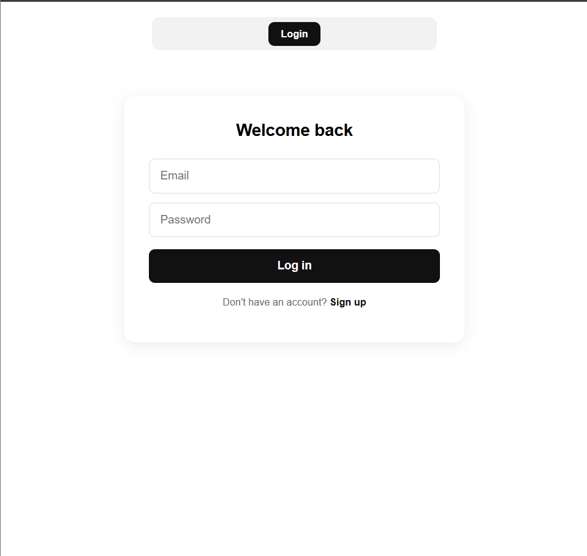
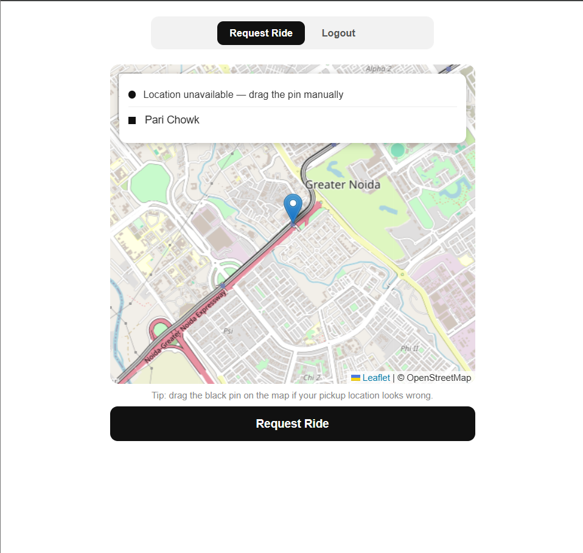
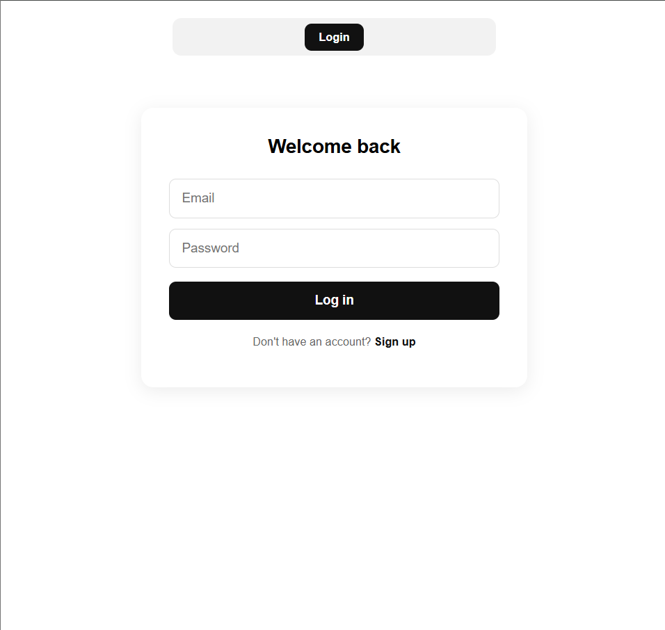

# SplitRide

A full-stack ride-sharing platform that automatically groups nearby riders heading to the same destination and splits the fare between them.

**Live demo:** [splitride-sandy.vercel.app](https://splitride-sandy.vercel.app)

## The Idea

Public transport near college campuses is often crowded, and a solo cab ride to a popular nearby destination is expensive. SplitRide solves this by matching riders who are going the same way at roughly the same time into a group, so they can share one ride and split the cost.

## Features

- **JWT-based authentication** with Spring Security, including registration, login, and protected endpoints
- **Geospatial clustering** — ride requests are grouped by real-world proximity (Haversine distance) and time window, not exact-text location matching
- **Proportional fare splitting** — each rider's share is calculated based on their drop-point distance from the shared origin, using `BigDecimal` for accurate rounding
- **AI-generated trip summaries** — once a group is finalized, a natural-language summary is generated via the Groq LLM API
- **Live interactive map** — pickup/destination selection via Leaflet and OpenStreetMap, with location autocomplete and route rendering
- **Real-time group sync** — all riders in a group see updates (status, fare, summary) without manually refreshing
- **Phone number sharing** — matched riders can contact each other directly

## Tech Stack

**Backend:** Java, Spring Boot, Spring Security, Spring Data JPA, Hibernate, MySQL, JWT
**Frontend:** React, Leaflet / OpenStreetMap
**AI:** Groq LLM API (natural-language trip summaries)
**Deployment:** Docker, Render (backend), Vercel (frontend), Aiven (managed MySQL)

## Architecture

- **User Service** — registration, login, JWT issuance
- **Ride Group Service** — creates or matches an existing ride group using Haversine-distance clustering within a configurable time window
- **Group Member Service** — links a user to a group with their specific drop point
- **Settlement Service** — splits the total fare proportionally across members based on drop-point distance
- **Summary Service** — calls the Groq API to generate a natural-language trip summary once a group is finalized

## Running Locally

1. Clone the repo and set up a local MySQL database
2. Set the following environment variables (see `application.properties`):
    - `DB_URL`, `DB_USERNAME`, `DB_PASSWORD`
    - `JWT_SECRET`
    - `GROQ_API_KEY`
3. Run the backend: `./mvnw spring-boot:run`
4. In `splitride-frontend`, set `REACT_APP_API_URL` in `.env` to your backend URL, then run `npm install && npm start`

## Screenshots

| Login | Ride Request (Live Map) | Group Match & AI Summary |
|---|---|---|
|  |  |  |

The live demo above shows the full experience — login, live map-based ride request, group matching, fare split, and AI-generated trip summary.